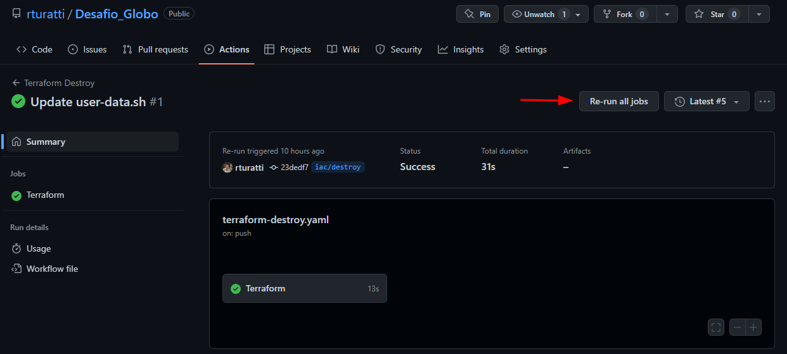

# Desafio DevOps - Globo

## Resolução do desafio

O desafio proposto exigiu a criação de um workflow automatizado que permita o deploy da infraestrutura e a execução da API. Para atender a essas exigências, foi criado um repositório no GitHub contendo os códigos necessários para essa implementação.

O workflow criado permitiu a realização do build da imagem e push para o Docker Hub, deploy do Terraform para a criação da infraestrutura na AWS, com a criação da instância EC2 e execução do container via docker-compose up -d. O deploy foi realizado com sucesso e a API está disponível diretamente pela porta 80 da instância EC2. Para garantir a segurança do ambiente, também foi criado um Security Group que permite o acesso à API somente pela porta 80 e 22 que pode ser desabilitada via terraform.

A API está rodando internamente com o nome app_api_1 na porta 8000 do container, sendo acessível pelo container rodrigoturatti/curl-globo que está na mesma rede chamada globo. Isso garante que o script para inserir comentários funcione corretamente.

Além disso, foi criado um workflow para o destroy da infraestrutura, que pode ser ativado manualmente. Essa ação é importante para garantir que não haja custos desnecessários na nuvem da AWS.

Com esse workflow automatizado, é possível realizar o deploy e destruir a infraestrutura rapidamente, o que é muito útil para testes e desenvolvimento. Também é possível reutilizar esse workflow para outros projetos e ambientes, tornando a implementação mais eficiente e ágil.

# Fluxo de trabalho
### Etapas para o desenvolvimento do desafio
1. Criei um repositório no GitHub.
1. Upload do desafio enviado para branch `main`.
1. Criada uma branch `develop` para desenvolvimento.
1. Criada uma branch `feature/Dockerfile` para desenvolvimento do Dockerfile.
1. Criada uma branch `feature/build-docker` para desenvolvimento do Workflow do GitHub - Docker Build. 
1. Criada uma branch `feature/terraform` para desenvolvimento do Terraform.


### Etapas para o desenvolvimento do Dockerfile
1. Criado o arquivo `Dockerfile` com a imagem do `python` e com o conteúdo do desafio.
1. Alterado o arquivo `Dockerfile` para a imagem do `python:alpine3.13` para diminuir o tamanho da imagem.
1. Alterada a ordem das instruções para melhorar o cache do Docker.
1. Criado o arquivo `.dockerignore` para ignorar arquivos desnecessários para o build da imagem. 
1. Criado o arquivo `comments.sh` para executar o script e inserir os comentários na API.
1. Alterado o arquivo `Dockerfile` para copiar o script `comments.sh` para a imagem e instalação do curl.


### Etapas para o desenvolvimento do Workflow do GitHub - Docker Build
1. Criado o arquivo `.github/workflows/docker-build.yaml` com o workflow para o build da imagem.
1. Alterada a identação do arquivo `Dockerfile` para acionamento automático do workflow.
1. Build e Push executados com sucesso.


### Etapas para a criação do Terraform
1. Criado o arquivo `provider.tf` com o provider da `AWS` e a criação do arquivo de tfstate dentro do bucket `ct-terraformstate`.
1. Criado o arquivo `variables.tf` com as variáveis de ambiente.
1. Criado o arquivo `locals.tf` com as variáveis locais.
1. Criado o arquivo `network.tf` com a criação da VPC, Subnets, Internet Gateway, Route Table.
1. Criado o arquivo `security_group.tf` com o Security Group.
1. Criado o arquivo `instance.tf` com a criação da instância EC2 e chave privada que está sendo salva dentro do bucket `ct-terraformstate`.
1. Criado o arquivo `user-data.sh` com o script de instalação dos pacotes e comandos necessários.    
1. Alterado o arquivo `security_group.tf` para permitir o acesso a API pela porta 80.
1. Ajustado o arquivo `user-data.sh` para instalação do Docker, Docker-Compose, wget e execução do container via `docker-compose up -d`.

### Etapas para o desenvolvimento do Workflow do GitHub - Terraform Create e Destroy
1. Criado o arquivo `.github/workflows/terraform-create.yaml` com o workflow para o deploy da infraestrutura.
1. Criado o arquivo `.github/workflows/terraform-destroy.yaml` com o workflow para o destroy da infraestrutura somente ativado manualmente.

## Estrutura de diretórios

 - **.github** , pasta onde está o workflow do GitHub para o build da imagem e deploy da infraestrutura.
 - **app** , pasta onde está o código da aplicação, o `Dockerfile` e o `docker-compose.yaml`.
 -  **curl** , pasta onde está o script `comments.sh` e `Dockerfile` para inserir os comentários na API via imagem exclusiva do `curl`.
 -  **images** , pasta onde está as imagens utilizadas nos documentos.
 -  **terraform** , pasta onde está os arquivos do Terraform para a criação da infraestrutura na AWS.

## Como executar o projeto
Ao efetuar qualquer alteração no código da aplicação, o workflow do GitHub irá realizar o build da imagem e push para o Docker Hub. Após o push, o workflow do Terraform irá realizar o deploy da infraestrutura na AWS.

### Destruindo o ambiente
Para destruir o ambiente, pode ser executado o workflow do Terraform para o destroy da infraestrutura. Para isso, basta acessar o repositório no GitHub e clicar em `Actions` e selecionar o workflow `Terraform Destroy`.



## Como testar o projeto

### Monitorando os container ativos, restarts e logs - Portainer
Após o deploy da infraestrutura, é possível acessar o painel do Portainer via browser pela url `https://$IP_SERVER:9443`. Para isso, basta acessar o IP público da instância EC2 criada pelo Terraform na porta `9443`. Após o acesso, é necessário criar um usuário e senha para acesso.
**OBS: o acesso ao Portainer é feito via HTTPS, e caso demore para acessar o dado timeout e será necessário reiniciar o container do Portainer.**


**Script para inserir os comentários na API**
*OBS: o script está sendo executado dentro do container `rodrigoturatti/curl-globo` que executa na sequência após o container da API estar disponível, para garantir que sempre seja possível fazer a listagem dos comentários.*

```bash
#!/bin/bash

# matéria 1
echo "Inserindo comentários na matéria 1"
curl -sv $IP_SERVER/api/comment/new -X POST -H 'Content-Type: application/json' -d '{"email":"alice@example.com","comment":"first post!","content_id":1}'
curl -sv $IP_SERVER/api/comment/new -X POST -H 'Content-Type: application/json' -d '{"email":"alice@example.com","comment":"ok, now I am gonna say something more useful","content_id":1}'
curl -sv $IP_SERVER/api/comment/new -X POST -H 'Content-Type: application/json' -d '{"email":"bob@example.com","comment":"I agree","content_id":1}'

# matéria 2
echo "Inserindo comentários na matéria 2"
curl -sv $IP_SERVER/api/comment/new -X POST -H 'Content-Type: application/json' -d '{"email":"bob@example.com","comment":"I guess this is a good thing","content_id":2}'
curl -sv $IP_SERVER/api/comment/new -X POST -H 'Content-Type: application/json' -d '{"email":"charlie@example.com","comment":"Indeed, dear Bob, I believe so as well","content_id":2}'
curl -sv $IP_SERVER/api/comment/new -X POST -H 'Content-Type: application/json' -d '{"email":"eve@example.com","comment":"Nah, you both are wrong","content_id":2}'

echo "Comentários inseridos com sucesso!"
```

*Listar os comentários da API*

```bash
# matéria 1
curl -sv $IP_SERVER/api/comment/list/1

# matéria 2
curl -sv $IP_SERVER/api/comment/list/2
```

## Melhorias futuras

1. Criar um deploy automatizado do Terraform para os ambientes de desenvolvimento, homologação e produção.
2. Criar um repositório privado no ECR para a imagem da aplicação.
3. Criar um deploy em ECS Fargate para a aplicação. (Não foi criado para o desafio por questões de custos na conta que foi utilizada.)