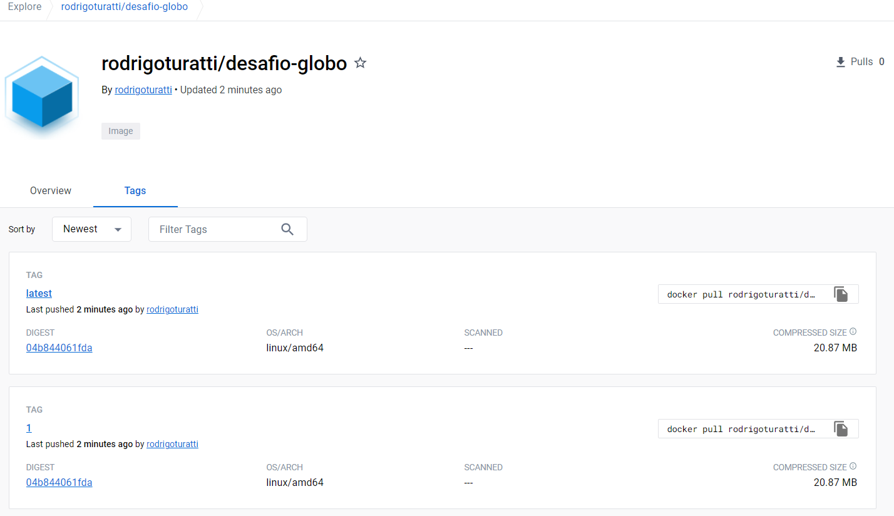

# Etapas para o desenvolvimento do desafio

1. Criei um repositório no GitHub.
1. Upload do desafio enviado para branch `main`.
1. Criada uma branch `develop` para desenvolvimento.
1. Criada uma branch `feature/Dockerfile` para desenvolvimento do Dockerfile.

### Etapas para o desenvolvimento do Dockerfile
1. Criado o arquivo `Dockerfile` com a imagem do `python` e com o conteúdo do desafio.
1. Alterado o arquivo `Dockerfile` para a imagem do `python:alpine3.13` para diminuir o tamanho da imagem.
1. Alterada a ordem das instruções para melhorar o cache do Docker.
1. Criado o arquivo `.dockerignore` para ignorar arquivos desnecessários para o build da imagem. 
1. Criado o arquivo `comments.sh` para executar o script e inserir os comentários na API.
1. Alterado o arquivo `Dockerfile` para copiar o script `comments.sh` para a imagem e instalação do curl.

### Etapas para o desenvolvimento do Workflow do GitHub
1. Criado o arquivo `.github/workflows/docker-build.yaml` com o workflow para o build da imagem.
1. Alterada a identação do arquivo `Dockerfile` para acionamento automático do workflow.
1. Build e Push executados com sucesso.

### Etapas para a criação do Terraform
1. Criado o arquivo `provider.tf` com o provider da `AWS` e a criação do arquivo de tfstate dentro do bucket `ct-terraformstate`.
1. Criado o arquivo `variables.tf` com as variáveis de ambiente.
1. Criado o arquivo `locals.tf` com as variáveis locais.
1. Criado o arquivo `network.tf` com a criação da VPC, Subnets, Internet Gateway, Route Table.
1. Criado o arquivo `security_group.tf` com o Security Group.
1. Criado o arquivo `instance.tf` com a criação da instância EC2 e chave privada que está sendo salva dentro do bucket `ct-terraformstate`.
1. Criado o arquivo `user-data.sh` com o script de instalação dos pacotes e comandos necessários.    
1. Alterado o arquivo `security_group.tf` para permitir o acesso a API pela porta 80.    